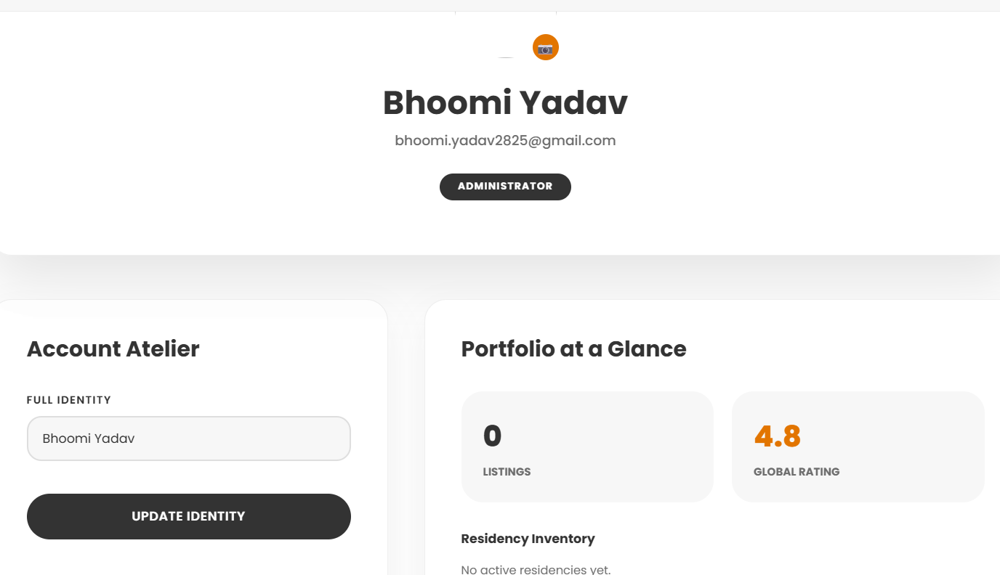
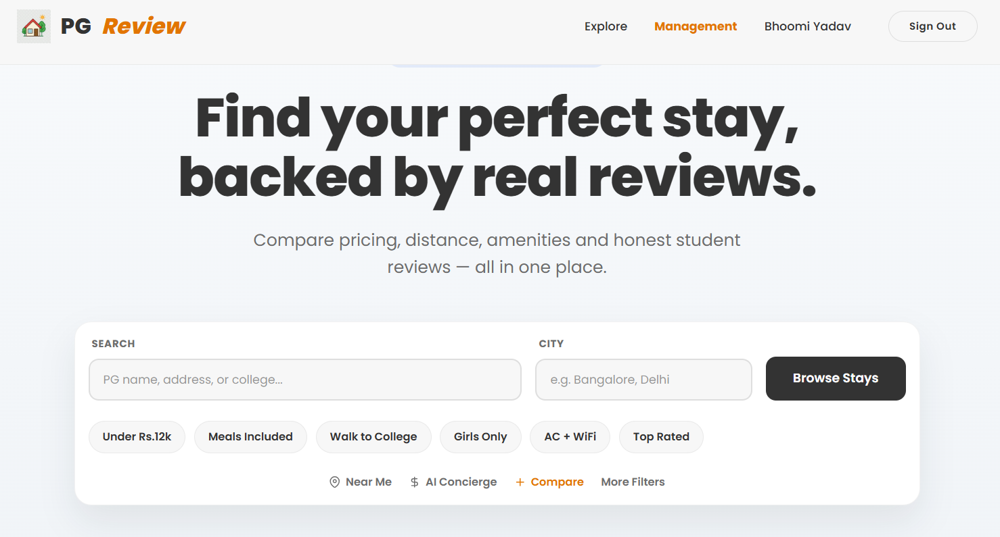

# 🏠 PG Hostel Review Platform

A full-stack web platform to help students find verified PG/hostel accommodations with transparent pricing and real reviews.

---

## 🚀 Live Demo
https://pg-hostel-review.web.app/

---

## ✨ Features
- 🔍 Search PGs by location & filters
- ⭐ Review & rating system
- ✅ Verified listings for trust
- 🧑‍💼 Admin dashboard for management
- 📱 Fully responsive design

---

## 🛠 Tech Stack
- React.js
- Tailwind CSS
- Firebase (Authentication, Firestore, Hosting)
- Vite

---

## 📸 Screenshots

### 🏠 Homepage

### 📋 Listing Page

### 🧑‍💼 Admin Dashboard
dd your project screenshots here)

---

## 📌 Future Improvements
- AI-based PG recommendation system
- PG comparison feature
- Advanced filters

---

## 👩‍💻 Author
Bhoomi Yadav
